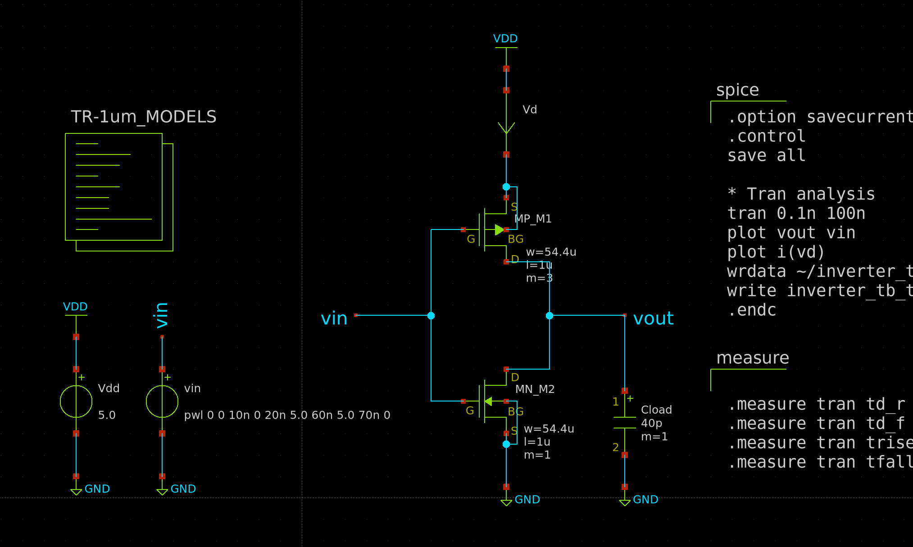
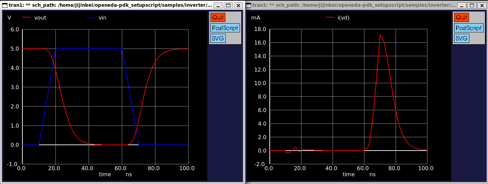
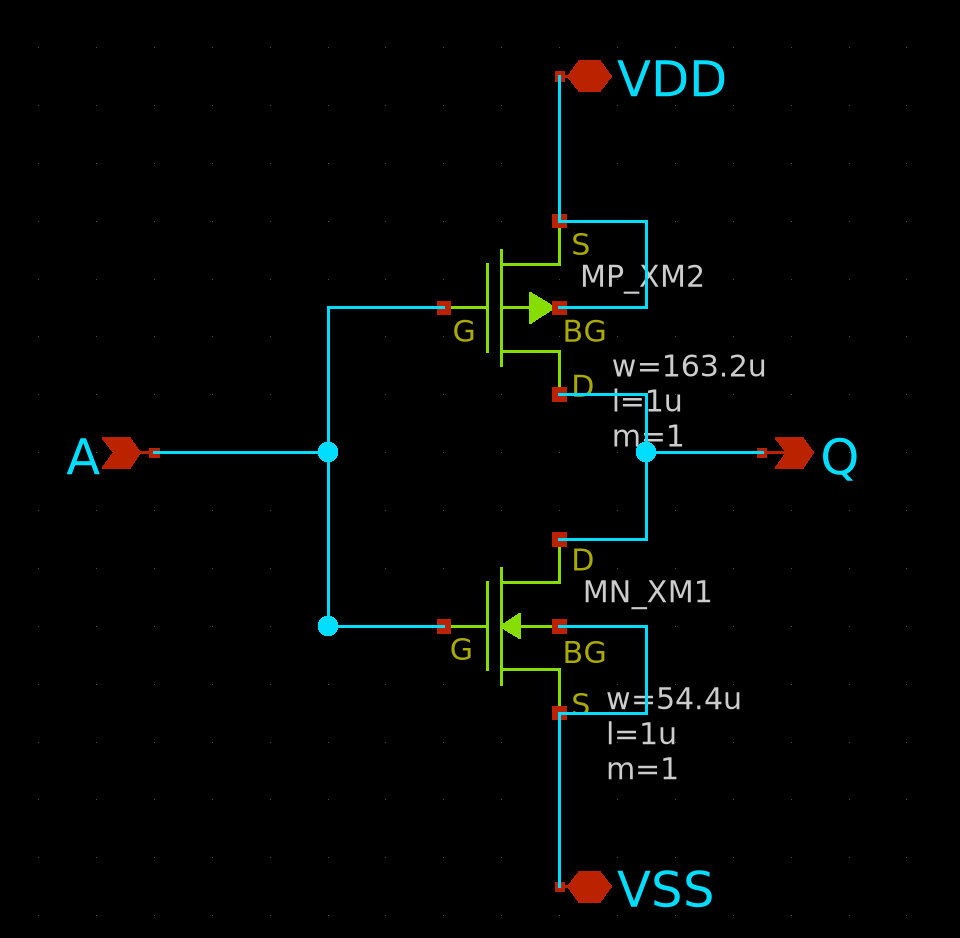
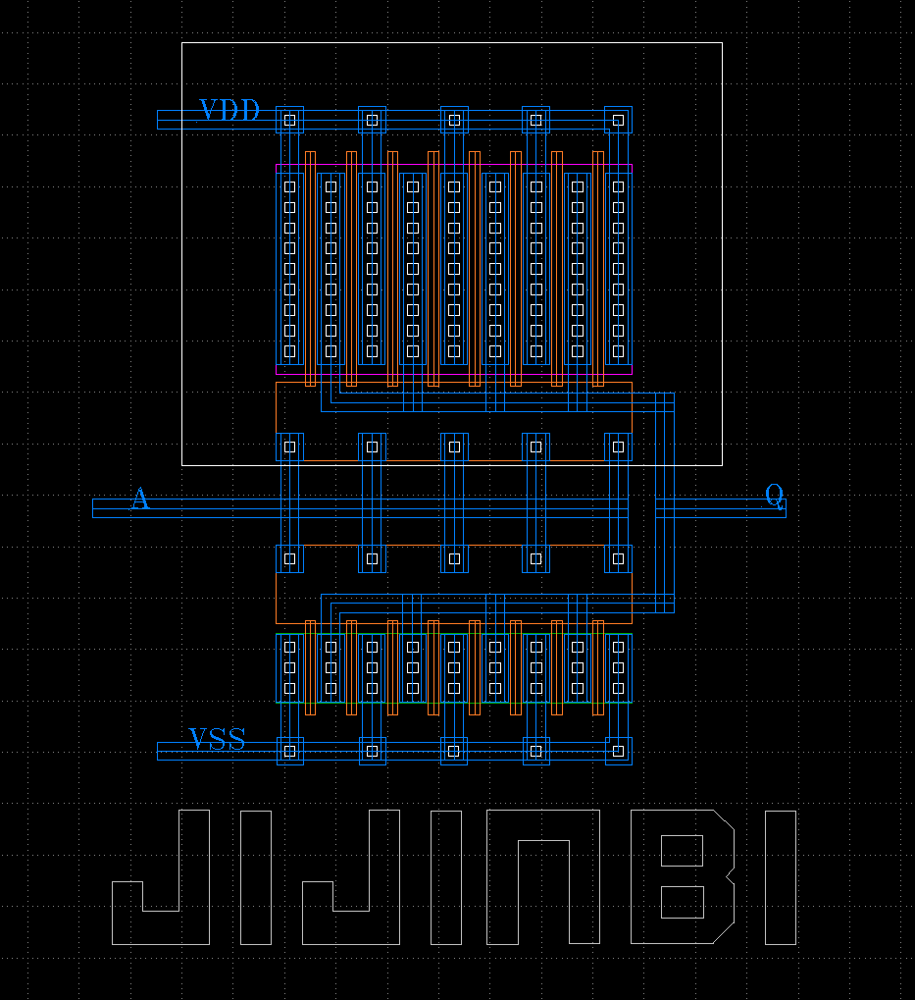

# TR-1um CMOS Inverter

[2026年09月イベント：初めての半導体設計・製造体験！一日で作るインバータ回路ハンズオン](https://ishikai.connpass.com/event/407081/)　で作成した、TR-1um PDKを用いたCMOSインバータのサンプルです。

Xschemで回路設計・シミュレーションを行い、KLayoutでレイアウト、DRC、LVSまで実施しました。
また、外部負荷として40 pFを想定し、十分なドライブ能力を得られるようMOSFETのサイズを調整しています。

## 40pF 対応

40 pF の外部負荷を駆動するため、最終的にMOSFETを以下のサイズにしました。
```
NMOS L = 1.0 µm W = 54.4 µm
PMOS L = 1.0 µm W = 163.2 µm
```
MOSFET幅を増加させることで、40 pFを十分に充放電できるようになりました。
最終設計では、
```
t_rise = 1.01721e-08 (targ= 7.89900e-08 trig= 6.88179e-08)
t_fall = 1.06297e-08 (targ= 2.96993e-08 trig= 1.90695e-08)
```
となり、rise time、fall timeともに約10 nsとなりました。

以下の回路でシミュレーションを行いました。



得られた過渡応答は以下の通りです。



## レイアウト

`inverter.sch` のインバーター回路図は以下のようになっています。


大きなMOSFETをそのまま1本の長いトランジスタとして配置するとレイアウトが大きくなるため、マルチフィンガー化しています。

```
NMOS: 6.8 µm × 8 (Gate) = 54.4 µm
PMOS: 20.4 µm × 8 (Gate) = 163.2 µm
```

`inverter.gds` のレイアウト図は以下のようになっています。


# 感想

半導体設計についてほとんど知識がない状態で参加しましたが、まずは手を動かしてインバータを完成させることに重点を置いたハンズオンだったため、比較的スムーズに進めることができました。

一方で、今回のように40 pFの負荷を駆動するためのMOSFETサイズ調整など、少し発展的なことを試してみると、ハンズオンで扱った内容だけでは分からない部分も多く出てきました。
その際は、AIを利用したり、ISHI会のオペアンプ・ハンズオンで扱われていた、より発展的な回路やレイアウトを参考にしながら進めました。

特に印象に残ったのはレイアウト設計です。
配線幅や間隔、コンタクトなどには設計ルールによる制約があり、単に回路図通りにつなげばよいわけではありません。
限られた面積と設計ルールの中で、DRCを満たしながら配線や素子配置を考える必要がありました。

ハンズオン中に何度も言われていた「半導体は物理と化学」という言葉についても、実際にレイアウトを作り、設計ルールに触れることで少し実感できたように思います。
回路図上では抽象化されているトランジスタも、実際のチップ上では物理的な構造物として作られるのだということが、今回の体験を通してかなり具体的に理解できました。

このイベントに参加していなければ、自分にとって少し縁遠かった半導体設計・製造の仕事内容について、解像度が低いままだったと思います。
実際に回路設計からレイアウト、DRC、LVSまで一通り触れられたことで、とても良い経験になりました。

ISHI会の運営の皆さま、素敵なイベントを開催していただきありがとうございました。

今後も、今回学んだことを生かしながら、自分なりのICチップを設計してみたいと思います。
